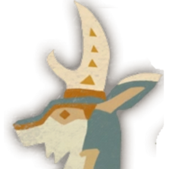
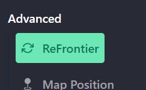
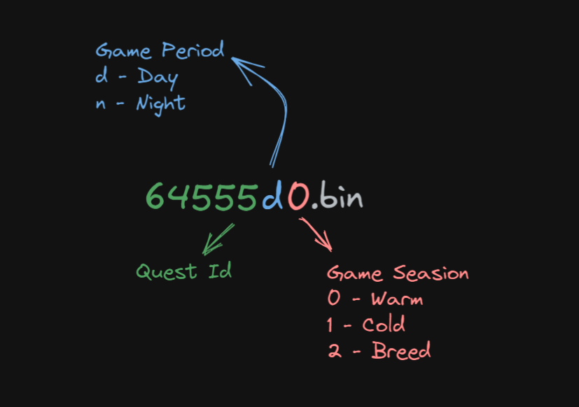
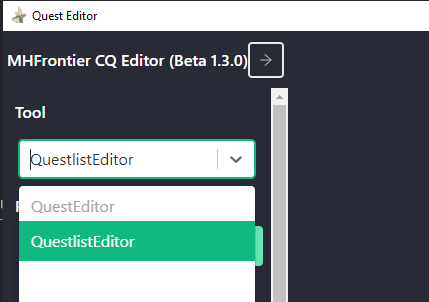
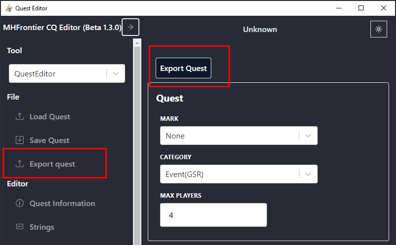

<h1 align="center">
  
   
  MHFrontier CQ Tool
   
</h1>

MHFrontier CQ Tool is a free and open-source solution to edit and create quests for Monster Hunter Frontier Z

### Table of Contents

- [Install](#install)
- [Instructions](#instructions)
- [Contributions](#contributions)
- [License](#license)

## Install

Download them from the [Github Release](https://github.com/Invasor-de-Fronteiras/mhfrontier-cq-tool/releases) for Windows, Linux and Mac.

## Instructions

> If you are using [Erupe](https://github.com/ZeruLight/Erupe), set `DevMode` and `QuestDebugTools` to **true** on `config.json`. It shows the quest filename on console logs.

### Decompress the Quest

It is required to decompress the quest file so the editor can read it. Use [ReFrontier](https://github.com/mhvuze/ReFrontier) for that. If [ReFrontier](https://github.com/mhvuze/ReFrontier) is inside the editor folder it can be used directly from the editor.

### Quest File

The quest is currently a binary file, [Erupe](https://github.com/ZeruLight/Erupe) does not implement each part of the quest, it reads all file content and sends it to the client.

The quest’s file name is not random, it is composed of the quest ID, in-game daytime and in-game season. Below is an example of how it looks:

It's important to understand this so you can get the quests on your server and on your quest list.

### New Quest

> Currently, the editor does not support creating a quest from scratch, because it is not possible to edit a 100% map yet.

To create a new quest, copy an existing one, [decompress](#decompress-the-quest) it and rename the [quest id](#quest-file) to an id that is not already being used in your server. Open the quest in the editor and change the **Quest Id** in **Quest Information** to chosen id.

Nice! Now do the quest changes as your desire and save it.

### Quest List Manager

To show quest in game it's necessary to add quest in questlist, for its you need to change the selected tool **QuestEditor** to **QuestlistEditor**.

Now you click in **Load Folder** and select questlist folder, after this you can manager your quests in menu **Questlist** and add quests clicking on **Add Quest from file**.

After all you can save questlist in **Save Questlist**.

#### Quest List Manager for [Erupe 9.1](https://github.com/ZeruLight/Erupe/releases/tag/v9.1.0)

After update [9.1](https://github.com/ZeruLight/Erupe/releases/tag/v9.1.0), the quest list files were removed and now we require to export a template from the quest file to folder **/bin/events**.

To do this just go to **Export quest** in QuestEditor and choose questlist options.

## Contributions

Issue and PR welcome!

## License

GPL-3.0 License. See the [License here](/LICENSE) for details.
