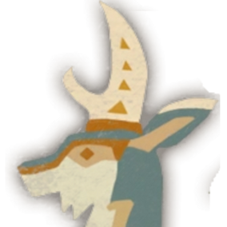
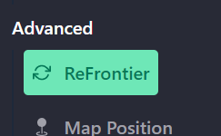
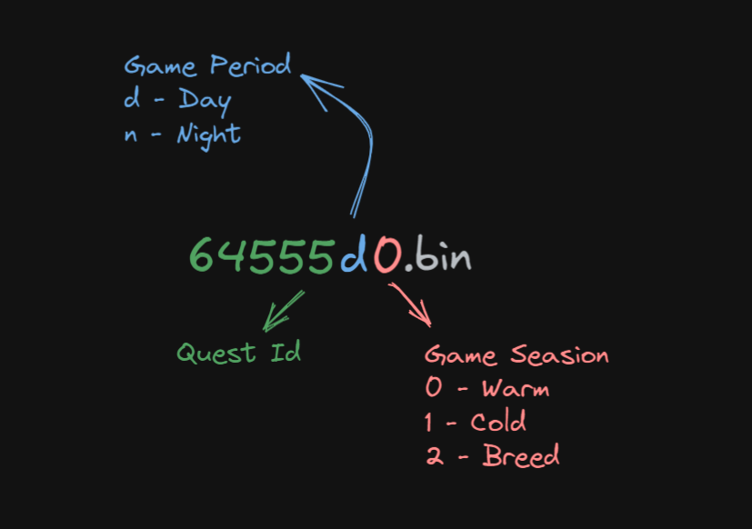
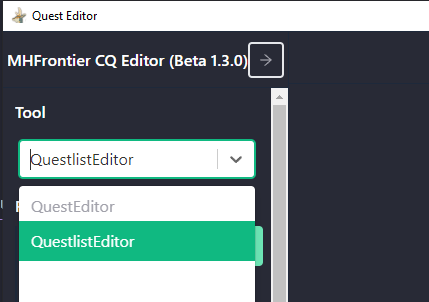
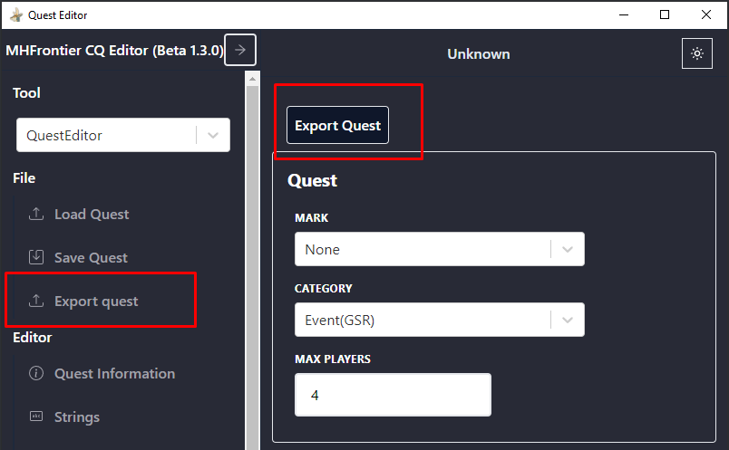

<h1 align="center">
  
   
  MHFrontier CQ Tool
   
</h1>

MHFrontier CQ Tool is a free and open-source solution to edit and create quests for Monster Hunter Frontier Z

### Table of Contents

- [Install](#install)
- [Instructions](#instructions)
- [Troubleshooting](#troubleshooting)
- [Contributions](#contributions)
- [License](#license)

## Install

Download from the [Github Release](https://github.com/Invasor-de-Fronteiras/mhfrontier-cq-tool/releases) for Windows, Linux and Mac.

### Prerequisites

**[ReFrontier](https://github.com/mhvuze/ReFrontier)** is required to decompress quest files before opening them in the editor.

Setup steps:
1. Download ReFrontier from [its repository](https://github.com/mhvuze/ReFrontier/releases)
2. Place the `ReFrontier.exe` executable in the **same folder** as the CQ Tool executable
3. The editor will detect it automatically and enable the built-in decompress feature

> ReFrontier is **not bundled** with CQ Tool — you must download and place it manually.

## Instructions

> If you are using [Erupe](https://github.com/ZeruLight/Erupe), set `DevMode` and `QuestDebugTools` to **true** on `config.json`. It shows the quest filename on console logs.

### Decompress the Quest

Quest files from the server are compressed and **must be decompressed** before the editor can read them. Use [ReFrontier](https://github.com/mhvuze/ReFrontier) for that. With ReFrontier in the same folder as the editor, you can decompress directly from the editor UI.

### Quest File

The quest is currently a binary file, [Erupe](https://github.com/ZeruLight/Erupe) does not implement each part of the quest, it reads all file content and sends it to the client.

The quest’s file name is not random, it is composed of the quest ID, in-game daytime and in-game season. Below is an example of how it looks:

It's important to understand this so you can get the quests on your server and on your quest list.

### New Quest

> Currently, the editor does not support creating a quest from scratch, because it is not possible to edit a 100% map yet.

To create a new quest, copy an existing one, [decompress](#decompress-the-quest) it and rename the [quest id](#quest-file) to an id that is not already being used in your server. Open the quest in the editor and change the **Quest Id** in **Quest Information** to chosen id.

Nice! Now do the quest changes as your desire and save it.

### Quest List Manager

To show quest in game it's necessary to add quest in questlist, for its you need to change the selected tool **QuestEditor** to **QuestlistEditor**.

Now you click in **Load Folder** and select questlist folder, after this you can manager your quests in menu **Questlist** and add quests clicking on **Add Quest from file**.

After all you can save questlist in **Save Questlist**.

#### Quest List Manager for [Erupe 9.1](https://github.com/ZeruLight/Erupe/releases/tag/v9.1.0)

After update [9.1](https://github.com/ZeruLight/Erupe/releases/tag/v9.1.0), the quest list files were removed and now we require to export a template from the quest file to folder **/bin/events**.

To do this just go to **Export quest** in QuestEditor and choose questlist options.

## Troubleshooting

### "The system cannot find the path specified" when using ReFrontier

ReFrontier executable is not in the correct location. Make sure `ReFrontier.exe` is in the **same folder** as the CQ Tool executable, not in a subfolder or a different directory.

### "Failed to fill whole buffer" when opening a quest file

The quest file is still compressed. You must [decompress it first](#decompress-the-quest) using ReFrontier before opening it in the editor.

## Contributions

Issue and PR welcome!

## License

GPL-3.0 License. See the [License here](/LICENSE) for details.
